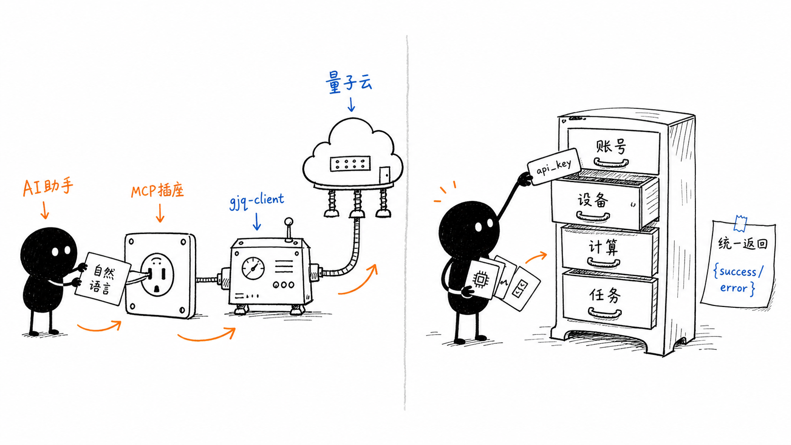
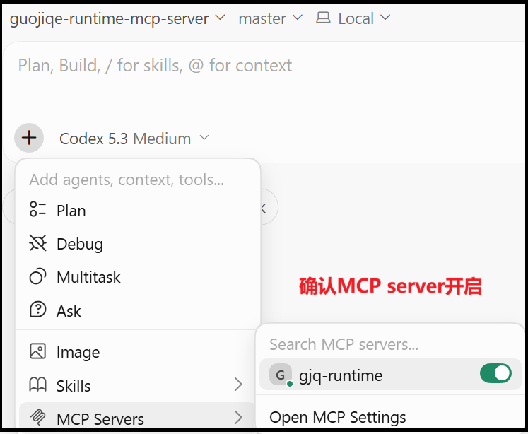
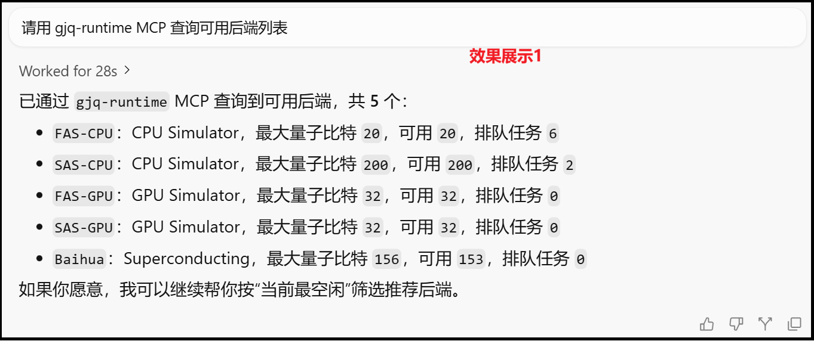
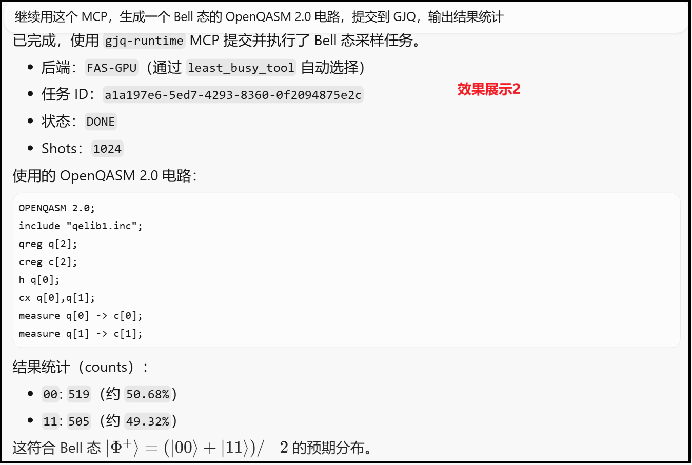

# GJQ Runtime MCP Server（中文）

一个 [Model Context Protocol](https://modelcontextprotocol.io)（MCP）服务器，
让AI助手通过国基量子云SDK[`gjq-client`](https://pypi.org/project/gjq-client/)
与[**国基量子计算云平台**](https://tiangongqs.com/)交互。



## 功能

- **账号管理**：配置并查看云平台凭据
- **设备管理**：列出后端、查询配置 / 校准信息、获取最空闲后端
- **计算任务**：从 OpenQASM 提交采样（sampling）与期望估计（estimation）任务
- **任务管理**：轮询状态、获取结果 / 日志 / 详情、列出任务
- **示例电路**：Bell / GHZ / 叠加 / 随机，以 MCP 资源形式提供

### 功能展示






## 安装与启动（以Cursor为例）

1. 克隆仓库并创建虚拟环境

```bash
git clone <this-repo>
cd gjq-runtime-mcp-server
python -m venv .venv

# Windows
.\.venv\Scripts\activate
# Linux/macOS
source .venv/bin/activate

pip install -e .
```

2. `.env.example`重命名为`.env`，进入设置 `GJQ_API_KEY=你的_api_key`。（API key 从 <https://www.tiangongqs.com/cloud> 获取）

3. 本地启动 MCP Server（先验证可运行）

```bash
python -m gjq_runtime_mcp_server
```

4. 在项目根目录创建 `.cursor/mcp.json`

```json
# Windows(该行去除)
{
  "mcpServers": {
    "gjq-runtime": {
      "command": ".venv\\Scripts\\python.exe",
      "args": ["-m", "gjq_runtime_mcp_server"],
      "cwd": "/path/to/gjq-runtime-mcp-server",
      "env": { "GJQ_API_KEY": "你的_api_key" }
    }
  }
}

# Linux/macOS(该行去除)
{
  "mcpServers": {
    "gjq-runtime": {
      "command": ".venv/bin/python",
      "args": ["-m", "gjq_runtime_mcp_server"],
      "cwd": "/path/to/gjq-runtime-mcp-server",
      "env": { "GJQ_API_KEY": "你的_api_key" }
    }
  }
}
```

5. 在 Cursor 中验证

- 重启 Cursor。
- 打开 `Cursor Settings → Tools & MCPs → Installed MCP Servers`。
- 确认有 `gjq-runtime`，打开开关，并检查显示小绿点。

## MCP 工具

- 账号：`setup_gjq_account_tool`、`active_account_info_tool`
- 设备：`list_backends_tool`、`get_backend_configuration_tool`、`get_backend_properties_tool`、`least_busy_tool`
- 计算：`sample_tool`、`estimate_tool`
- 任务：`get_task_status_tool`、`get_task_result_tool`、`get_task_log_tool`、`get_task_detail_tool`、`list_my_tasks_tool`

所有工具返回 `{"status": "success" | "error", ...}`。

> 提交电路时 OpenQASM 2.0 开箱即用；如需提交 OpenQASM 3 电路，请额外安装解析库：
> `pip install qiskit_qasm3_import`。

## MCP 资源

`gjq://status`、`circuits://bell-state`、`circuits://ghz-state`、`circuits://superposition`、`circuits://random`

## 其他 MCP 客户端配置

上面的 JSON 适用于 Cursor、Claude Desktop 等基于 JSON 配置的客户端。

| 客户端 | 配置文件 |
|--------|----------|
| Cursor | `.cursor/mcp.json`（项目根目录） |
| Claude Desktop | macOS：`~/Library/Application Support/Claude/claude_desktop_config.json` |
| Codex | `~/.codex/config.toml`（TOML 格式，见下） |

Codex 使用 TOML 而非 JSON，在 `~/.codex/config.toml` 中添加如下内容
（顶层表名必须是 `mcp_servers`）：

```toml
[mcp_servers.gjq-runtime]
command = "/path/to/gjq-runtime-mcp-server/.venv/bin/python"
args = ["-m", "gjq_runtime_mcp_server"]
cwd = "/path/to/gjq-runtime-mcp-server"

[mcp_servers.gjq-runtime.env]
GJQ_API_KEY = "你的_api_key"
```

## Agent 技能

配套技能位于 [`skills/gjq-quantum-runtime/`](skills/gjq-quantum-runtime/SKILL.md)。
在 Cursor 中使用时，把该目录复制到 `.cursor/skills/`（项目级）或
`~/.cursor/skills/`（个人级）。

## 安全说明

- API key 以**明文**存储在 `~/.gjq_client/gjq_client_account.json` 以及 MCP 客户端配置的 `env` 中，请当作机密妥善保管，切勿提交 `.env`。

## 开发

```bash
pip install -e ".[test]"
pytest
```

## 许可证

Apache License 2.0
